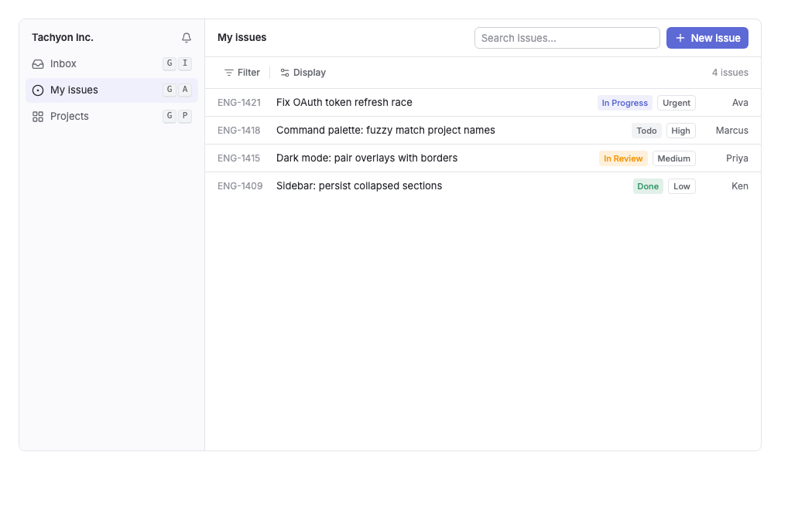

# ページ構成例（Issues 一覧）

`@tachyon-sdk/native-ui` でフルページを組むときの参照実装。Linear 風の Issues 一覧ページを、DSコンポーネント + デザイントークンだけで構成する（実レンダリング検証済み）。



## この例が示す構成ルール

- **レイアウトグルーはインライン style + `--nui-*` トークン**で書く。色は `hsl(var(--nui-*))`、角丸は `var(--nui-radius-*)`。ユーティリティクラスを発明しない。
- **密度**: サイドバー 240px、サイドバー項目 32px、テーブル行 36px、ツールバーは `size='sm'` の ghost ボタン、本文 13px。
- **色の階層**: アプリ背景 `--nui-background` → パネル `--nui-surface` → 選択中 `--nui-selected`。テキストは `foreground` → `muted-foreground` → `subtle-foreground` の3段。
- **アクセントは1箇所**: `variant='primary'` は「New issue」だけ。他は secondary / ghost。
- **ステータスは Badge の意味variant**（`accent` = 進行中、`warning` = レビュー中、`success` = 完了、`neutral` = 未着手、`outline` = 優先度などのメタ情報）。
- **キーボードファースト**: ナビ項目の右端に `<Kbd>` でショートカットを添える。

## コード

```tsx
import {
	Badge,
	Button,
	Input,
	Kbd,
	Separator,
	TooltipProvider,
} from '@tachyon-sdk/native-ui'
import {
	Bell,
	CircleDot,
	Inbox,
	LayoutGrid,
	ListFilter,
	Plus,
	Settings2,
} from 'lucide-react'

const issues = [
	{ id: 'ENG-1421', title: 'Fix OAuth token refresh race', status: 'In Progress', priority: 'Urgent', assignee: 'Ava' },
	{ id: 'ENG-1418', title: 'Command palette: fuzzy match project names', status: 'Todo', priority: 'High', assignee: 'Marcus' },
	{ id: 'ENG-1415', title: 'Dark mode: pair overlays with borders', status: 'In Review', priority: 'Medium', assignee: 'Priya' },
	{ id: 'ENG-1409', title: 'Sidebar: persist collapsed sections', status: 'Done', priority: 'Low', assignee: 'Ken' },
]

const statusVariant = (s: string) =>
	s === 'Done' ? 'success' : s === 'In Progress' ? 'accent' : s === 'In Review' ? 'warning' : 'neutral'

export const IssuesPage = () => (
	<TooltipProvider>
		<div
			style={{
				display: 'flex',
				width: 960,
				height: 560,
				background: 'hsl(var(--nui-background))',
				color: 'hsl(var(--nui-foreground))',
				border: '1px solid hsl(var(--nui-border))',
				borderRadius: 'var(--nui-radius-lg)',
				overflow: 'hidden',
				fontSize: 13,
			}}
		>
			{/* Sidebar — 240px, list rows 32px */}
			<nav
				style={{
					width: 240,
					flexShrink: 0,
					background: 'hsl(var(--nui-surface))',
					borderRight: '1px solid hsl(var(--nui-border))',
					padding: 8,
					display: 'flex',
					flexDirection: 'column',
					gap: 2,
				}}
			>
				<div style={{ display: 'flex', alignItems: 'center', justifyContent: 'space-between', padding: '6px 8px', fontWeight: 600 }}>
					Tachyon Inc.
					<Bell size={14} style={{ color: 'hsl(var(--nui-muted-foreground))' }} />
				</div>
				{[
					{ icon: Inbox, label: 'Inbox', kbd: 'G I' },
					{ icon: CircleDot, label: 'My issues', kbd: 'G A', active: true },
					{ icon: LayoutGrid, label: 'Projects', kbd: 'G P' },
				].map(({ icon: Icon, label, kbd, active }) => (
					<div
						key={label}
						style={{
							display: 'flex',
							alignItems: 'center',
							gap: 8,
							height: 32,
							padding: '0 8px',
							borderRadius: 'var(--nui-radius-md)',
							background: active ? 'hsl(var(--nui-selected))' : 'transparent',
							color: active ? 'hsl(var(--nui-foreground))' : 'hsl(var(--nui-muted-foreground))',
						}}
					>
						<Icon size={16} />
						<span style={{ flex: 1 }}>{label}</span>
						<span style={{ display: 'flex', gap: 2 }}>
							{kbd.split(' ').map((k) => (
								<Kbd key={k}>{k}</Kbd>
							))}
						</span>
					</div>
				))}
			</nav>

			{/* Main */}
			<main style={{ flex: 1, display: 'flex', flexDirection: 'column', minWidth: 0 }}>
				{/* Header — 検索 + 主要アクション */}
				<header
					style={{
						display: 'flex',
						alignItems: 'center',
						justifyContent: 'space-between',
						gap: 12,
						padding: '10px 16px',
						borderBottom: '1px solid hsl(var(--nui-border))',
					}}
				>
					<div style={{ fontWeight: 600 }}>My issues</div>
					<div style={{ display: 'flex', alignItems: 'center', gap: 8 }}>
						<div style={{ width: 240 }}>
							<Input placeholder='Search issues…' />
						</div>
						<Button variant='primary'>
							<Plus />
							New issue
						</Button>
					</div>
				</header>

				{/* Toolbar — ghost ボタン + 縦 Separator */}
				<div style={{ display: 'flex', alignItems: 'center', gap: 4, padding: '8px 16px' }}>
					<Button variant='ghost' size='sm'>
						<ListFilter />
						Filter
					</Button>
					<Separator orientation='vertical' style={{ height: 16 }} />
					<Button variant='ghost' size='sm'>
						<Settings2 />
						Display
					</Button>
					<span style={{ marginLeft: 'auto', color: 'hsl(var(--nui-subtle-foreground))', fontSize: 12 }}>
						{issues.length} issues
					</span>
				</div>

				{/* Issue rows — 36px */}
				<div style={{ flex: 1, overflowY: 'auto' }}>
					{issues.map((issue) => (
						<div
							key={issue.id}
							style={{
								display: 'flex',
								alignItems: 'center',
								gap: 12,
								height: 36,
								padding: '0 16px',
								borderTop: '1px solid hsl(var(--nui-border))',
							}}
						>
							<span style={{ width: 64, flexShrink: 0, color: 'hsl(var(--nui-subtle-foreground))', fontSize: 12 }}>
								{issue.id}
							</span>
							<span style={{ flex: 1, overflow: 'hidden', textOverflow: 'ellipsis', whiteSpace: 'nowrap' }}>
								{issue.title}
							</span>
							<span style={{ display: 'flex', gap: 6, flexShrink: 0 }}>
								<Badge variant={statusVariant(issue.status)}>{issue.status}</Badge>
								<Badge variant='outline'>{issue.priority}</Badge>
							</span>
							<span style={{ width: 56, flexShrink: 0, textAlign: 'right', color: 'hsl(var(--nui-muted-foreground))', fontSize: 12 }}>
								{issue.assignee}
							</span>
						</div>
					))}
				</div>
			</main>
		</div>
	</TooltipProvider>
)
```
